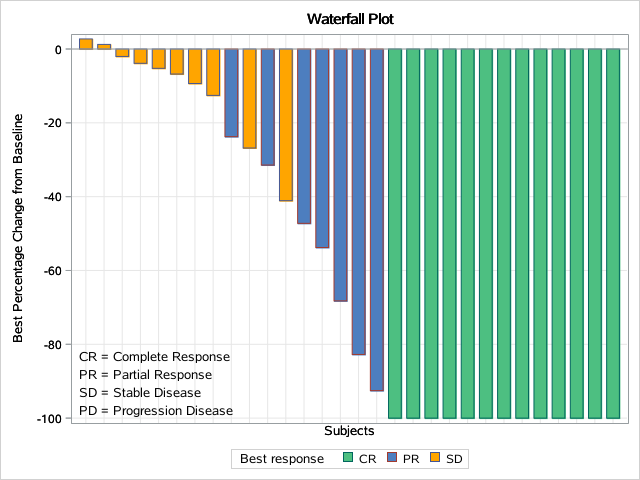
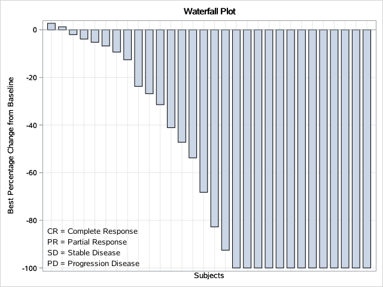

[SAS Help Center: LAYOUT OVERLAY Statement](https://documentation.sas.com/doc/en/pgmsascdc/v_041/grstatgraph/p0ra82ol659t4ln1ifal7w0nbydm.htm)    

从一个或多个 GTL 语句构建复合图形（composite），复合图形可以是整个Graph，也可以是Graph中的单元格。 如果此布局嵌套在 GRIDDED 或 LATTICE 布局中，则复合图形通常会为父布局（parent layout）中的一个单元格提供内容。  
- Restriction：可以将一个或多个二维图添加到 LAYOUT OVERLAY 语句创建的图形区域，但所有图形将共享同一组轴。不允许创建3-D 图形。  
- Interaction：当嵌套在另一种布局类型中时，OVERLAY 布局定义父布局中一个单元格的图形显示。 此时可为每个单元指定单独的 OVERLAY 布局。
- Tips：
	 - 如果希望 X 轴和 Y 轴上的单位大小相同，可使用 LAYOUT OVERLAYEQUATED 语句。
	 - 默认情况下，LAYOUT OVERLAY 块中指定的第一个图定义轴特征。 如果想要使另一个图来定义轴特征，请在该图的语句中指定 PRIMARY=TRUE。
	 - 重叠图按照指定的顺序堆叠。 最后指定的图放置在顶部。 
	 - 当绘图堆叠时，上方绘图可能会掩盖其下方绘图。 在这种情况下，可以更改绘图顺序或使用透明度使所有图形数据可见。 
	 - LAYOUT OVERLAY 块主要用于指定 2-D 绘图语句，但您也可以指定其他语句，例如 DISCRETELEGEND、CONTINUOUSLEGEND 和 ENTRY。  

## 1 语法（Syntax）
```SAS
LAYOUT OVERLAY </options>;
  GTL-statements;
  <INNERNARGIN </option(s)>;
    block-plot-statement(s); | axis-table statement(s);
  ENDINNERMAGIN;>
  <...more-innermargin-blocks...>>
ENDLAYOUT;
```

## 2 可选参数（Summary of Optional Arguments）
### 2.1 外观选项（Appearance options）
- **ASPECTRATIO=AUTO | _positive-number_**
	- 指定绘图的墙区域（wall area）的纵横比。
	- AUTO：墙壁面积的大小设置为可以填充整个空间的最大面积 OVERLAY 布局内的可用空间。
	- _positive-number_：0.75 = 3/4 aspect ratio；1.0 = a square aspect ratio.
	- default：AUTO
- **BACKGROUNDCOLOR=_style-reference_ | _color_**
	- 指定layout的背景颜色。
	- default：The GraphBackground: Color style reference
- **BORDER=TRUE | FALSE**
	- 指定是否绘制layout周围的边框。
	- default：FALSE
- **BORDERATTRS=_style-element_ | _style-element (line-options)_ | _(line-options)_
	- 指定layout周围边框的线条属性。
	- default：The GraphBorderLines style element
- **CYCLEATTRS=TRUE | FALSE**
	- 指定嵌套绘图语句中标记、线条和填充的默认视觉属性是否在绘图之间自动更改。
	- ==FALSE==：不循环多个图的默认视觉属性。 例如，如果叠加三个系列图，则每条系列线都具有相同的默认视觉属性。
	- ==TRUE==：尝试使用 GraphData1–GraphDataN 样式元素为适用的图（散点图和系列图等）分配不同的视觉属性。 布局中的某些图不参与循环（例如参考线和垂线）。
	- default：FALSE
- **OPAQUE=TRUE | FALSE**
	- 指定layout的背景是非透明（TRUE）还是透明（FALSE）。
	- default：FALSE
- **OUTERPAD=AUTO | _dimension_ | _(pad-options)_**
	- 指定在布局边框之外添加的额外空间量。
	- ==AUTO==：指定使用该组件的默认外部填充。
	- ==_dimension_==：指定用于布局边框左侧、右侧、顶部和底部的额外空间的尺寸。
	- ==_(pad-options)_==：一个或多个*name-value*填充选项的空格分隔列表，括在括号中。 该列表可以包含以下一个或多个pad options：
		- LEFT=_dimension_
		- RIGHT=_dimension_
		- TOP=_dimension_
		- BOTTOM=_dimension_
	- tip：未分配填充的边将使用默认量进行填充。
	- default：AUTO
- **PAD=_dimension_ | _(pad-options)_**
	- 指定在布局边框内添加的额外空间量。
	- ==_dimension_==：指定用于布局边框左侧、右侧、顶部和底部的额外空间的尺寸。
	- ==_(pad-options)_==：一个或多个*name-value*填充选项的空格分隔列表，括在括号中。 该列表可以包含以下一个或多个pad options：
		- LEFT=_dimension_；default = 0
		- RIGHT=_dimension_；default = 0
		- TOP=_dimension_；default = 0
		- BOTTOM=_dimension_；default = 0
	- tip：未分配填充的边将使用默认量进行填充。
- **WALLCOLOR=_style-reference_ | _color_**
	- 指定绘图墙区域的填充颜色。
	- default：The GraphWalls: Color style reference
	- interaction：若WALLDISPLAY=NONE或WALLDISPLAY=(OUTLINE)，则该选项将被忽略。
- **WALLDISPLAY=STANDARD | ALL | NONE | _(display-options)_**
	- 指定是否显示绘图的墙（wall）和墙轮廓（wall outline）。
	- STANDARD：显示filled wall。GraphWalls样式元素的FrameBorder属性的设置决定是否显示墙轮廓（wall outline）。
	- ALL：显示filled，outlined wall
	- NONE：displays no wall and no wall outline
	- _(display-options)_：指定一个或多个显示选项的空格分隔列表，括在括号中。该列表可以包含以下一个或多个选项：
		- OUTLINE：显示wall outline
		- FILL：显示filled wall area
	- default：STANDARD
	- tips：使用 WALLCOLOR= 选项控制墙壁的填充颜色。所占用单元格的墙壁填充和轮廓的外观属性由 GraphWalls 样式元素设置。对于空单元格，轮廓颜色由 GraphBorderLines 样式元素的 ContrastColor 属性设置，线条样式为实心，线条粗细为 1 像素。  

### 2.2 坐标轴选项（Axes options）
- **X2AXISOPTS=_(axis-options)_**
	- 指定一个或多个X2轴选项。
	- 参见[SAS Help Center: Axis Options for LAYOUT OVERLAY](https://documentation.sas.com/doc/en/pgmsascdc/v_041/grstatgraph/n0fksz728ytyz2n1ws13vlnkudyn.htm)。
- **XAXISOPTS=_(axis-options)_**
	- 指定一个或多个X轴选项。
	- 参见[SAS Help Center: Axis Options for LAYOUT OVERLAY](https://documentation.sas.com/doc/en/pgmsascdc/v_041/grstatgraph/n0fksz728ytyz2n1ws13vlnkudyn.htm)。
- **Y2AXISOPTS=_(axis-options)_**
	- 指定一个或多个Y2轴选项。
	- 参见[SAS Help Center: Axis Options for LAYOUT OVERLAY](https://documentation.sas.com/doc/en/pgmsascdc/v_041/grstatgraph/n0fksz728ytyz2n1ws13vlnkudyn.htm)。
- **YAXISOPTS=_(axis-options)_**
	- 指定一个或多个Y轴选项。
	- 参见[SAS Help Center: Axis Options for LAYOUT OVERLAY](https://documentation.sas.com/doc/en/pgmsascdc/v_041/grstatgraph/n0fksz728ytyz2n1ws13vlnkudyn.htm)。

## 3 程序示例
### 3.1 示例1
使用LAYOUT OVERLAY语句绘制简单的曲线图：
```SAS
/*测试数据集*/
data test;
  input USUBJID $ PCHG responsen response $ @@;
  datalines;
  S01001 2.73   3 SD
  S01002 1.25   3 SD
  S01003 -2.01  3 SD
  S01004 -3.87  3 SD
  S01005 -5.23  3 SD
  S01006 -6.78  3 SD
  S01007 -9.35  3 SD
  S01008 -12.56 3 SD
  S01009 -23.74 2 PR
  S01010 -26.82 3 SD
  S01011 -31.43 2 PR
  S01012 -41.09 3 SD
  S01013 -47.23 2 PR
  S01014 -53.78 2 PR
  S01015 -68.24 2 PR
  S01016 -82.75 2 PR
  S01017 -92.55 2 PR
  S01018 -100   1 CR
  S01019 -100   1 CR
  S01020 -100   1 CR
  S01021 -100   1 CR
  S01022 -100   1 CR
  S01023 -100   1 CR
  S01024 -100   1 CR
  S01025 -100   1 CR
  S01026 -100   1 CR
  S01027 -100   1 CR
  S01028 -100   1 CR
  S01029 -100   1 CR
  S01030 -100   1 CR
;
run;

proc format;
  value resp 1 = "CR" 2 = "PR" 3 = "SD" 4 = "PD";
run;

data test;
  set test;
  format responsen resp.;
run;

/*创建模板*/
proc template;
  define statgraph waterfall;
  /*定义动态变量*/
  dynamic title XLABEL YLABEL _VAR _ORDER _PCHG _FILL;
    begingraph / /*designwidth = 960 designheight = 720*/;
      entrytitle title;
	  /*分配条形图填充颜色*/
	  discreteattrmap name = "colors" / ignorecase = true;
	    value "CR" / fillattrs=(color = CX4DBF81);
		value "PR" / fillattrs=(color = CX4D7EBF);
		value "SD" / fillattrs=(color = orange);
		value "PD" / fillattrs=(color = red);
	  enddiscreteattrmap;
	  /*关联条形图变量和属性*/
	  discreteattrvar attrvar = barcolors var = _VAR attrmap = "colors";

	  layout overlay / 
	    xaxisopts = (label = XLABEL griddisplay = on display = (label line))
	    yaxisopts = (label = YLABEL griddisplay = on display = all);
		if (upcase(_FILL) in ("COLORS"))/*颜色区分response*/
	      barchart x = _ORDER y = _PCHG / group = barcolors name = "bar" barwidth = 0.7;
	      discretelegend 'bar' / opaque=true border=true halign=center 
                               valign=center title=" Best response"
                               sortorder=ascendingformatted;
		endif;
		if (upcase(_FILL) in ("NOCOLORS"))/*不区分response*/
	      barchart x = _ORDER y = _PCHG / name = "bar" barwidth = 0.7;
		endif;

		/*增加图表说明*/
	    layout gridded / rows=4 order=columnmajor border=false autoalign=(bottomleft);
	      entry textattrs=(size=10pt) halign=left "CR = Complete Response";
		  entry textattrs=(size=10pt) halign=left "PR = Partial Response";
		  entry textattrs=(size=10pt) halign=left "SD = Stable Disease";
		  entry textattrs=(size=10pt) halign=left "PD = Progression Disease";
	    endlayout;
      endlayout;
    endgraph;
  end;
run;

/*图形渲染*/
proc sgrender data=test template=waterfall;
  dynamic title = "Waterfall Plot" XLABEL = "Subjects" YLABEL = "Best Percentage Change from Baseline"
          _VAR = "responsen" _ORDER = "USUBJID" _PCHG = "PCHG" _FILL = "colors";
run;

proc sgrender data=test template=waterfall;
  dynamic title = "Waterfall Plot" XLABEL = "Subjects" YLABEL = "Best Percentage Change from Baseline"
          _ORDER = "USUBJID" _PCHG = "PCHG" _FILL = "nocolors";
run;
```

结果如下：  
  

### 3.2 示例2
📗参考文献：  
\[1\][PharmaSUG-2016-DG03.pdf](https://www.pharmasug.org/proceedings/2016/DG/PharmaSUG-2016-DG03.pdf)  
\[2\][Pharmasug-China-2019-HW06.pdf ](https://www.lexjansen.com/pharmasug-cn/2019/HW/Pharmasug-China-2019-HW06.pdf)  
使用LAYOUT OVERLAY语句嵌套LAYOUT GRIDDED语句生成瀑布图：  
```SAS
/*测试数据集*/
data test;
  input USUBJID $ PCHG responsen response $ @@;
  datalines;
  S01001 2.73   3 SD
  S01002 1.25   3 SD
  S01003 -2.01  3 SD
  S01004 -3.87  3 SD
  S01005 -5.23  3 SD
  S01006 -6.78  3 SD
  S01007 -9.35  3 SD
  S01008 -12.56 3 SD
  S01009 -23.74 2 PR
  S01010 -26.82 3 SD
  S01011 -31.43 2 PR
  S01012 -41.09 3 SD
  S01013 -47.23 2 PR
  S01014 -53.78 2 PR
  S01015 -68.24 2 PR
  S01016 -82.75 2 PR
  S01017 -92.55 2 PR
  S01018 -100   1 CR
  S01019 -100   1 CR
  S01020 -100   1 CR
  S01021 -100   1 CR
  S01022 -100   1 CR
  S01023 -100   1 CR
  S01024 -100   1 CR
  S01025 -100   1 CR
  S01026 -100   1 CR
  S01027 -100   1 CR
  S01028 -100   1 CR
  S01029 -100   1 CR
  S01030 -100   1 CR
;
run;

proc format;
  value resp 1 = "CR" 2 = "PR" 3 = "SD" 4 = "PD";
run;

data test;
  set test;
  format responsen resp.;
run;

/*创建模板*/
proc template;
  define statgraph waterfall;
  /*定义动态变量*/
  dynamic title XLABEL YLABEL _VAR _ORDER _PCHG _FILL;
    begingraph / /*designwidth = 960 designheight = 720*/;
      entrytitle title;
	  /*分配条形图填充颜色*/
	  discreteattrmap name = "colors" / ignorecase = true;
	    value "CR" / fillattrs=(color = green);
		value "PR" / fillattrs=(color = blue);
		value "SD" / fillattrs=(color = orange);
		value "PD" / fillattrs=(color = red);
	  enddiscreteattrmap;
	  /*关联条形图变量和属性*/
	  discreteattrvar attrvar = barcolors var = _VAR attrmap = "colors";

	  layout overlay / 
	    xaxisopts = (label = XLABEL griddisplay = on display = (label line))
	    yaxisopts = (label = YLABEL griddisplay = on display = all);
		if (upcase(_FILL) in ("COLORS"))/*颜色区分response*/
	      barchart x = _ORDER y = _PCHG / group = barcolors name = "bar" barwidth = 0.7;
	      discretelegend 'bar' / opaque=true border=true halign=center 
                               valign=center title=" Best response"
                               sortorder=ascendingformatted;
		endif;
		if (upcase(_FILL) in ("NOCOLORS"))/*不区分response*/
	      barchart x = _ORDER y = _PCHG / name = "bar" barwidth = 0.7;
		endif;

		/*增加图表说明*/
	    layout gridded / rows=4 order=columnmajor border=false autoalign=(bottomleft);
	      entry textattrs=(size=10pt) halign=left "CR = Complete Response";
		  entry textattrs=(size=10pt) halign=left "PR = Partial Response";
		  entry textattrs=(size=10pt) halign=left "SD = Stable Disease";
		  entry textattrs=(size=10pt) halign=left "PD = Progression Disease";
	    endlayout;
      endlayout;
    endgraph;
  end;
run;

/*图形渲染*/
proc sgrender data=test template=waterfall;
  dynamic title = "Waterfall Plot" XLABEL = "Subjects" YLABEL = "Best Percentage Change from Baseline"
          _VAR = "responsen" _ORDER = "USUBJID" _PCHG = "PCHG" _FILL = "colors";
run;

proc sgrender data=test template=waterfall;
  dynamic title = "Waterfall Plot" XLABEL = "Subjects" YLABEL = "Best Percentage Change from Baseline"
          _ORDER = "USUBJID" _PCHG = "PCHG" _FILL = "nocolors";
run;
```
\_FILL = "colors" 结果如下：  
  

\_FILL="nocolors"结果如下：

