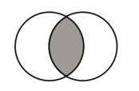
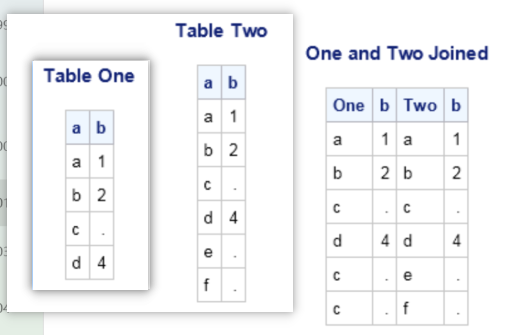
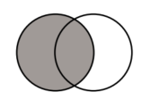
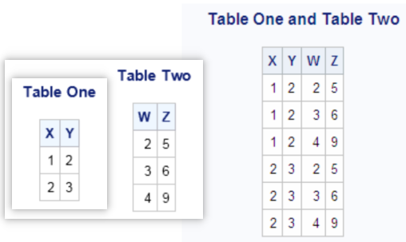

# Retrieving Data from Multiple Tables   

本章将介绍：
- 通过将多个表连接在一起，从多个表中选择数据。select data from more than one table by joining the tables together.   
- 使用子查询根据另一个表的数据值从一个表中选择数据。use subqueries to select data from one table based on data values from another table.   
- 使用集合运算符组合多个查询的结果。combine the results of more than one query by using set operators.  

## 1 Selecting Data from More Than One Table By Using Joins  
<font color=blue>使用 <B>Joins</B> 从多个表中选择数据。</font>    
### 1.1 Inner Joins  
#### 1.1.1 使用 where 子句  

返回两个数据集中共有的行。可以指定要在 **where** 子句中比较需匹配值的列。  
   

示例1：列 x 同时存在于表 one 和表 two 中，因此需指定 one.x 与 two.x 。  
```SAS
proc sql;
	title 'Table One and Table Two';
	select * from one, two
		where one.x=two.x;
```  

示例2：可按照任一表中的一列或多列对联结表的输出进行排序。下述示例的输出按 BarrelsPerDay 列的降序排列。（此例中无需限定 BarrelsPerDay，因为此列仅存在于 OilProd 表中）。  
```SAS
proc sql outobs=6;
	title 'Oil Production/Reserves of Countries';
	select p.country, barrelsperday 'Production', barrels 'Reserves'
		from sql.oilprod p, sql oilrsrvs r
		where p.country = r.country
		order by barrelsperday desc;
```  

#### 1.1.2 使用 INNER JOIN 关键字  

**INNER JOIN** 关键字可以用于连接表，**ON** 子句替换了用于指定要连接的列的 WHERE 子句。  

示例：  
```SAS
proc sql;
	select p.country, barrelsperday 'Production', barrels 'Reserves'
		from sql.oilprod p inner join sql.oilrsrvs r
			on p.sountry = r.country
	order by barrelsperday desc;
```  

#### 1.1.3 使用比较运算符（Comparison Operators）  

可以使用 WHERE 子句中的等号（=）以外的比较运算符来连接表。  

示例：  
```SAS
proc sql;
	title 'US Cities South of Cairo, Egypt';
	select us.City, us.State, us.Latitude, world.city, world.latitude
		from sql.worldcitycoords world, sql.uscitycoords us
		where world.city = 'Cairo' and
			us.latitude lt world.latitude;
```  

#### 1.1.4 Joins 中 Null 值的效果  

PROC SQL 将 null 视为缺失值，并将其视为连接的匹配项。任何 null 都将与联接中相同类型（字符或数字）的任何其他 null 值匹配。  

示例：  
```SAS
proc sql;
	title 'One and Two Joined';
	select one.a 'One', one.b, two.a 'Two', two.b
		from one, two
		where one.b=two.b;
```  

结果如下：  
  

#### 1.1.5 从多于两个表中选择数据  

示例：  
```SAS
proc sql outobs=10;
	select us.Capital format=$15., us.Name 'State' format=$15.,
		   pc.Code, c.Latitude, c.Longitude
		from sql.unitedstates us, sql.postalcodes pc,
		   sql.uscitycoords c
		where us.Capital=c.City and
			  us.Name=pc.Name and
			  pc.Code=c.State;
```  

### 1.2 Outer Joins  

外部联接的结果输出包括联接源表中匹配的行和不匹配的行。不匹配的行在不匹配表的列中为 null 值。使用 ON 子句而不是 WHERE 子句来指定要联接表的一列或多列。但是，您可以继续使用 WHERE 子句对查询结果进行子集设置。   

#### 1.2.1 包括与左部外连接不匹配的行  

左侧外联接包括匹配的行，以及左侧表中与右侧表不匹配的行。使用关键字 **LEFT JOIN** 和 **ON** 指定左侧外联接。  
  

示例1：  
```SAS
proc sql outobs=10;
	title 'Coordinates of Capital Cities';
	select Capital format=$20., Name 'Country' format=$20.,
		   Latitude, Longitude
		from sql.countries a left join sql.worldcitycoords b
			on a.Capital=b.City and
			   a.Name=b.Country
			order by Capital;
```  

#### 1.2.2 包括与右部外连接不匹配的行  

用关键字 **RIGHT JOIN** 和 **ON** 指定的右联接与左联接相反：来自右表（ FROM 子句中列出的第二个表）的不匹配行包含在输出中的所有匹配行中。  

示例：  
```SAS
proc sql outobs=10;
	title 'Populations of Capitals Only';
	select City format $20., Country 'Country' format=$20.,
		   Population
		from sql.countries right join sql.worldcitycoords
			on Capital=City and
			   Name=Country
			order by City;
```   

#### 1.2.3 使用完全外部连接选择所有行  

关键字 **FULL JOIN** 和 **ON** 指定的完全外部连接，选取所有匹配和不匹配的行。  

示例：（注意数字符号（#）在标签中用作换行符。）  
```SAS
proc sql outobs=10;
	title 'Populations and/or Coordinates of World Cities';
	select City '#City#(WorldCityCoords)' format=$20.,
		   Capital '#Capital#(Countries)' format=$20.,
		   Population, Latitude, Longitude
		from sql.countries full join sql.worldcitycoords
			on Capital = City and
			   Name = Country;
```  

### 1.3 Specialty Joins  

#### 1.3.1 使用 Cross Join 包括行的所有组合  

Cross Join 是笛卡尔乘积（Cartesian product），它返回两个表的乘积。其输出可以受到 **WHERE** 子句的限制。  

示例：  
```SAS
proc sql;
	title 'Table One and Table Two';
	select * from one cross join two;
```  

结果如下：  
  

#### 1.3.2 使用 Union Join 包含所有行  

Union join 在不匹配行的情况下组合两个表（类似 set），两个表中的所有的列和行都包括在内。使用 union join 连接两个表，类似于使用 **OUTER UNION** 集合运算符连接两个表。  

示例：  
```SAS
proc sql;
	select * from one union join two;
```  

结果如下：  
  

#### 1.3.3 使用 Natural Join 匹配行  

Natural join 会自动从每个表中选择列用于确定匹配的行。在 Natural Join 中，PROC SQL 标识每个表中具有相同名称和类型的列；这些列的值相等的行将作为匹配行返回。ON 子句是隐含的。  

示例：  
```SAS
proc sql outobs=6;
	title 'Oil Production/Reserves of Countries';
	select country, barrelsperday 'Production', barrels 'Reserve'
		from sql.oilprod natural join sql.oilrsrvs
		order by barrelsperday desc;
```  


