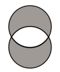

# Combining Queries with Set Operators  

PROC SQL 可以使用以下集合运算符将两个或多个各种方式查询的结果结合起来：  
- **UNION**：从两个查询中生成所有的唯一行（set + 去掉重复行）  
- **EXCEPT**：返回只在第一个查询中的行（从第一个查询中去掉与第二个查询重合的部分）  
- **INTERSECT**：返回两个查询共有的部分  
- **OUTER UNION**：连接查询结果（set）  

<font color=blue>Set 运算符根据两个查询中的列在被引用表中的位置将它们组合在一起，而不考虑列名。</font>两个查询中处于相对位置的列必须具有相同的数据类型。第一个查询中表的列名将成为输出表的列名。  

以下可选关键字可以更好地控制 Set 操作：  
- **ALL**：不消除重复行；**ALL**  不可以和 **OUTER UNION** 联合使用。  
- **CORRESPONDING (CORR)**：overlays 两个表中具有相同名称的列。与 **EXCEPT**、**INTERSECT** 和 **UNION** 一起使用时，**CORR** 会消除不在这两个表中的列。  

示例：（选择两个表中不重合的数据）  
```SAS
proc sql;
	title 'A EXCLUSIVE UNION B';
	(select * from sql.a
		except
		select * from sql.b)
	union
	(select * from sql.b
		except
		select * from sql.a);
```  

效果图如下：  
  


