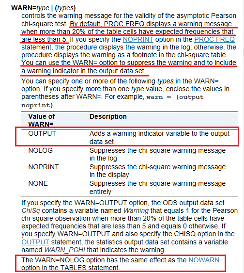
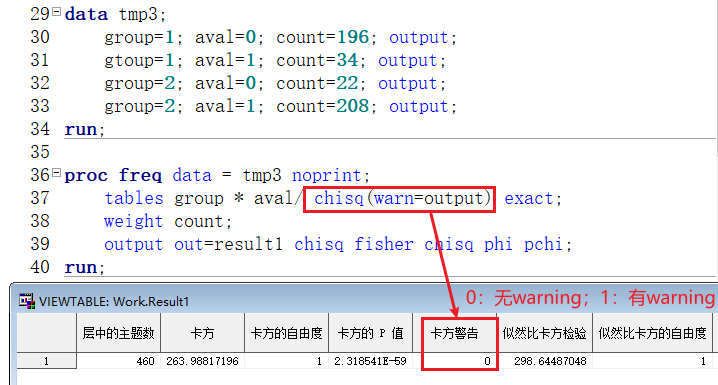

### 2023-10-11 RTF语法的unicode字符  
在 `pretext` 和 `posttext` 两个字段中，无法使用SAS自定义的特殊转移字符（如`^` 和 `@`），此时仅能使用RTF语法来实现特殊字符的输出显示。

示例：需要输出特殊字符：`®`，若使用以下程序，RTF无法解析：
```SAS
%let rtf_name1       = 表5.1.5 受试者分布 与cobas^{unicode 00ae} EGFR Mutation Test v2比对;/*填写图表标题*/

proc report data = rptdata split = "~" 
            style(report)={ protectspecialchars=on  asis=on  just=c outputwidth=100%
	                            fontfamily="Times New Roman" fontsize=10.5pt
	                            pretext="&pretext"
	                            posttext="\ql\fs21&posttext"}
```

此时需要使用RTF自带的转义写法，对于unicode字符，以`\u`标志开始，注意要将`00ae`转换为10进制（因为RTF仅能识别十进制字符；转换可使用windows自带字符映射表+计算器），最后以`;`结尾（注意需要使用`%str`屏蔽`;`的转义）。
```SAS
%let rtf_name1       = 表5.1.5 受试者分布 与cobas\u174%str(;) EGFR Mutation Test v2比对;/*填写图表标题*/
```


### 2023-10-13 SQL倒序排序  
需倒序排序的变量为 `var` ，语法为 `order by var desc`， 示例语句如下：  
```SAS
proc sql noprint;
    create table t_003_4 as select
        4 as num, 1 as seq, "    "||strip(nation) as describ,
        count(subjid) as count
    from adeff group by describ
        order by num, seq, count desc;
quit;
```


### 2023-10-16 SORT排序中的locale选项
在SAS的GBK环境和unicode环境下，使用PROC SORT过程对中文字符串进行排序会得到不同的结果，要保证在不同环境下运行得到的结果一致，此时需使用locale选项来规定字符串排序规则。  

示例如下：
```SAS
proc sort data = level1_seq sortseq = linguistic(locale = zh_CN);
	by level1;
quit;
```


### 2023-10-16 SORT排序中文本型数字排序问题
想要令文本型的数字根据数值大小排序为1，2，5，10，11，23这样，而不是按照字符顺序排列为1，10，11，12，2，23，5，可使用numeric_collation=on选项。  

示例如下：
```SAS
proc sort data = level1_seq sortseq = linguistic(numeric_collation=on);
	by level1;
quit;
```

### 2023-10-16 FREQ过程中binomial的level=选项的取值
需注意，level=的取值只能是：
1. level-number：数据集中观测的排序，而需数据的具体数值取值  
2. 'level-value'：数据的格式化取值  
真难理解！

### 2023-10-25 SAS中卡方检验与Fisher检验应用条件的判定及卡方警告导出   

  

  


