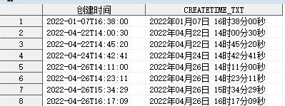
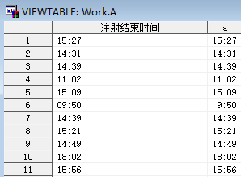

### 2023-11-02 复制逻辑库后，【输出格式没有找到或无法加载】的问题解决  
前提：复制的逻辑库中包含【Formats】文件夹。  
解决：假设复制的逻辑库存储在 raw 逻辑库中，使用 `options fmtsearch=(raw);` 即可。  

### 2023-11-02 查看数据集中全部变量的详细信息  
使用 **PROC CONTENTS** 语句：  
```SAS
proc contents data=lib.data-set out= noprint;
run;
```  

### 2023-11-03 SAS日期格式 e8601dt.  
可使用 e8601dt. 日期时间格式显示为类似于【YYMMDD10.】+【HHMMSS】的格式，如下：  
  

### 2023-11-03 关于 call execute 批量执行宏的问题  
在 call execute 中  
- 双引号内的宏/宏变量会首先被解析（读到这里就解析了），甚至不会等你的语句拼合完整；  
- 单引号内的宏/宏变量会在 call execute 位于的 data 步内解析，这也不合适；  
- 所以，如果要使用 call execute 批量执行宏，需要使用单引号+ %nrstr 来屏蔽宏。  

示例程序如下：  
```SAS
/*需调用数据集*/
%let raw = %nrstr("SUBJECT" "ICF" "DM" "RAND" "DS" "CM" "PD" "VS" "VS1" "WSRS" "VAS" "VAS1" "VAS2");

/*批量处理数据集格式转换*/
data _null_;
    set sashelp.vmember(where=(libname="RAWDATA" and memname in (&raw)));
    call execute('%nrstr(%CFormat(rawdata.'||dequote(memname)||','||dequote(memname)||');)');
run;
```  

### 2023-11-07 时间数据的数值文本格式转换  
示例如下：  
```SAS
data a;
    set rawdata.ins;
    a=input(instim,time5.);
    format a hhmm5.;
    keep instim a;
run;
```  

结果如下：  
  

### 2023-11-10 实现在任一小数位数上的向上取整  
尚未实现……待续。  

### 2023-11-30 关于两个主要评价指标的试验中脱落的定义  

1. 两个有效性评价指标，任一满足即可：其中一个主评缺失，应不算脱落；  

2. 两个有效性评价指标，两个都要满足：其中一个缺失，应算脱落；

3. 一个有效性评价指标，一个安全性评价指标：不太确定，安全性评价指标应不能缺失，具体情况具体分析；（此种情况下，注意两个指标评价的分析集不一致） 

PS：脱落率与分析数据集的定义不等同，需注意。