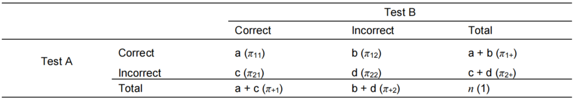

📗参考文献：
- [Equivalence and Noninferiority Testing Using SAS/STAT® Software](https://support.sas.com/resources/papers/proceedings15/SAS1911-2015.pdf)  
- [48616 - Design and analysis of noninferiority studies (sas.com)](https://support.sas.com/kb/48/616.html)  
- [SAS编程-Efficacy：如何进行样本率的比较？(卡方检验) - 简书 (jianshu.com)](https://www2.jianshu.com/p/b946d589e4a5)  
- [Testing Hypotheses for Equivalence and Non-inferiority with Binary and Survival Outcomes](https://support.sas.com/resources/papers/proceedings20/4641-2020.pdf)   
- [Adaptive Superiority and Noninferiority Trial Design with Paired Binary Data](https://www.researchgate.net/publication/286529606_Adaptive_Superiority_and_Noninferiority_Trial_Design_with_Paired_Binary_Data)  
- [Multicentre paired non-inferiority study of the cardiorespiratory monitoring performance of the wireless and non-adhesive Bambi® belt measuring diaphragm activity in neonates: study protocol | BMJ Paediatrics Open](https://bmjpaedsopen.bmj.com/content/6/1/e001430#DC1)  
- [Non-Inferiority Clinical Trials to Establish Effectiveness Guidance for Industry (fda.gov)](https://www.fda.gov/media/78504/download)  
- [A non-iterative implementation of Tango's score confidence interval for a paired difference of proportions - PubMed (nih.gov)](https://pubmed.ncbi.nlm.nih.gov/22893498/)  
- [SAS® Macros CORR_P and TANGO: Interval Estimation for the Difference Between Correlated Proportions in Dependent Samples](https://analytics.ncsu.edu/sesug/2013/SD-03.pdf)  

---

近期的工作过程中，需要对配对设计的数据进行非劣效检验，因为SAS中目前没有现成的模块可以使用，因此负责的同事查询了很多文献资料来进行参考，最后选定的是Tango法来计算置信区间，以实现非劣效检验。对同事提供的培训分享中的参考文献进行了比较粗浅的学习，在此记录分享一下。  
## 1 示例导入  

以下示例为对学龄前儿童进行了两次阅读障碍测试（Test A和Test B），其结果可分为两次测试都正确（Correct-Correct），Test A正确但Test B不正确（Correct-Incorrect），Test A不正确但Test B正确（Incorrect-Correct），两次测试均不正确（Incorrect-Incorrect）。  
  

## 2 等效性检验：McNemar检验 

来自相同观测样本或匹配配对样本的两个proportions是相关的（correlated）。<font color=blue>McNemar's test（1947）</font>常用于对两个相关的proportions进行<font color=blue>等效性检验</font>。   

在上述示例中，零假设为Test A的检测正确率$\pi_{1+}=[a+b]/n$等于Test B的检测正确率$\pi_{+1}=[a+c]/n$。因为$\pi_{11}$是$\pi_{1+}$和$\pi_{+1}$的共同项，因此检验零假设$\pi_{1+}-\pi_{+1}=0$等价于检验$\pi_{12}-\pi_{21}=0$。零假设的McNemar检验统计量$Q$计算公式如下：  
$$Q=\frac{(b-c)^2}{b+c}$$ 在零假设下，当$b+c$大于10时，$Q$统计量遵循自由度为1的近似卡方分布。  

## 3 非劣效检验-置信区间的计算：Tango Confidence Interval  

参考文献[SAS® Macros CORR_P and TANGO: Interval Estimation for the Difference Between Correlated Proportions in Dependent Samples](https://analytics.ncsu.edu/sesug/2013/SD-03.pdf) 中介绍的Tango's score confidence interval 来计算配对率差的置信区间。  

Tango提出的两个相关的proportions的差值的置信区间是通过迭代求解以下两个方程来估计的，直到估计的变化值（change）在预先设定的cutoff值以下。  
$$\frac{b-c-n\lambda}{\sqrt{n(2\hat{\pi}_{21})+\lambda(1-\lambda)}}=\pm{Z_{\alpha/2}}\ \ \ (1)$$  $\hat{\pi}_{21}$的估计公式为：  
$$\hat{\pi}_{21}=\frac{\sqrt{(B^2-4AC)-B}}{2A}\ \ \ (2)$$
其中，$A=2n$，$B=-b-c+(2n-b+c)\lambda$，$c=-c\lambda(1-\lambda)$。  

尽管Tango CI的计算过程比Wald和调整后的Wald区间更复杂，但上下限很容易通过割线法找到，具有经验上良好的覆盖概率[( Improved confidence intervals for the difference between binomial proportions based on paired data by Robert G. Newcombe, Statistics in Medicine, 17, 2635-2650 (1998))](https://pubmed.ncbi.nlm.nih.gov/10611622/)，并且可以应用于具有非对角线零单元的小样本。  

割线法原理可见百度：[割线法_百度百科 (baidu.com)](https://baike.baidu.com/item/%E5%89%B2%E7%BA%BF%E6%B3%95/5806354)  

根据公式(1)可知，要求置信区间，需先得到$\lambda$值，而$\lambda$值则可通过割线法求解得到。具体的程序实现可参考文献：[SAS® Macros CORR_P and TANGO: Interval Estimation for the Difference Between Correlated Proportions in Dependent Samples](https://analytics.ncsu.edu/sesug/2013/SD-03.pdf) ，此处也附上我自己参考文献程序理解后写的宏程序：  
```SAS
/*---Tango---*/
/*割线法*/
%MACRO secant(x0,x1,Z,out);
/*--------------------------------
x0:初始值1
x1:初始值2
Z:百分位数
--------------------------------*/
data &out;
    /*迭代次数*/
    iteration=1;
    x0=&x0;
    x1=&x1;
    do until (abs(change)<0.000001);/*迭代停止条件*/
        /*位点1函数值*/
        lambda=x0;
        AA=2*&n;
        BB=-1*&b-&c+(2*&n-&b+&c)*lambda;
        CC=-1*&c*lambda*(1-lambda);
        q=(sqrt(BB**2-4*AA*CC)-BB)/(2*AA);
        /*fx0分情况考虑:分母为0与分母不为0*/
        if (&n*(2*q)+lambda*(1-lambda)>=0) then fx0=&b-&c-&n*lambda-&z*sqrt(&n*(2*q+lambda*(1-lambda)));
        if (&n*(2*q)+lambda*(1-lambda)<0) then fx0=&b-&c-&n*lambda;

  
        /*位点2函数值*/
        lambda=x1;
        AA=2*&n;
        BB=-1*&b-&c+(2*&n-&b+&c)*lambda;
        CC=-1*&c*lambda*(1-lambda);
        q=(sqrt(BB**2-4*AA*CC)-BB)/(2*AA);
        /*fx0分情况考虑:分母为0与分母不为0*/
        if (&n*(2*q)+lambda*(1-lambda)>=0) then fx1=&b-&c-&n*lambda-&z*sqrt(&n*(2*q+lambda*(1-lambda)));
        if (&n*(2*q)+lambda*(1-lambda)<0) then fx1=&b-&c-&n*lambda;
  
        /*位点1与位点2的割线值*/
        secant=(fx1-fx0)/(x1-x0);

        /*迭代位点*/
        x2=x1-(fx1/secant);

        /*位点差值*/
        change=x2-x1;

        /*继续迭代*/
        x0=x1;
        x1=x2;
        iteration=iteration+1;
    end;
    keep x1;
run;
%MEND secant;

  

/*TangoCI*/
%MACRO tangoci(indata,outdata,uid,row,col,level,alpha,format);

proc sql noprint;
    select count(&uid) into : n from &indata;
    select count(&uid) into : a from &indata where &row =  &level and &col =  &level;
    select count(&uid) into : b from &indata where &row =  &level and &col ne &level;
    select count(&uid) into : c from &indata where &row ne &level and &col =  &level;
    select count(&uid) into : d from &indata where &row ne &level and &col ne &level;

    select probit(1-&alpha/2) into : ZL from &indata;
    select probit(&alpha/2) into : ZU from &indata;
quit;

  
/*调用割线法宏求置信区间上下限*/
%secant(-0.9999,0.9999,&zl,cll);
%secant(-0.9999,0.9999,&zu,clu);


data &outdata;
length dif $40. cll 8. clu 8. cl $40.;
    merge cll(rename=(x1=cll)) clu(rename=(x1=clu));
    dif=put((&b-&c)/&n,&format);
    cl=cat("(",strip(put(cll,&format)),", ",strip(put(clu,&format)),")");
run;

  
/*清除过程所用数据集*/
proc datasets lib=work noprint;
    delete cll clu;
quit;

%MEND tangoci;
```