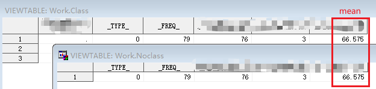
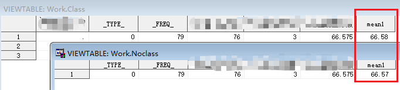
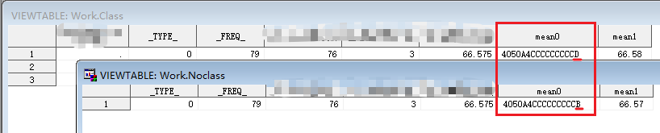
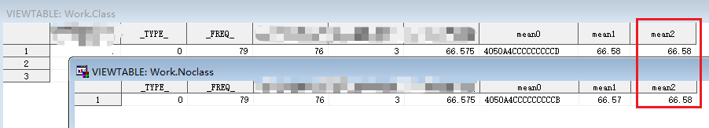
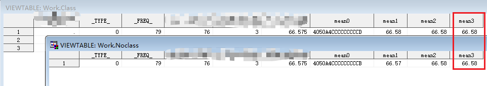

我在创建用于生成TFL的数据集时，通常会将数值型变量转换为字符型。因为 put 函数貌似能够对数值进行四舍五入，此前贪图方便，通常都是直接使用 put 函数直接转换，但在近期项目中，这种做法带来了一个让人摸不着头脑的问题。    

这是一个两组别的随机对照试验，同事采取的方法是各组别分别使用 means 过程计算描述统计量，我采取的方法是一个 means 过程获取全部组别的描述统计量。  

同事出表的核心程序如下：  
```SAS
proc means data=test n nmiss mean;
    var test1;
    output out=noclass n=n nmiss=nmiss mean=mean;
run;
```  

我出表的核心程序如下：  
```SAS
proc means data=test n nmiss mean;
    class group;
    var test1;
    output out=class n=n nmiss=nmiss mean=mean;
run;
```  

可以看到，我俩出表的程序，唯一的区别就是，我用了一个 class 语句，而同事没用；两段程序跑出来的结果分别输出到 noclass 和 class 两个数据集中。  

对两组合计的均值进行比对，两个数据集结果如下：  
  

可以看到，两个数据集中，均值都为`66.575`。  

然后，我们都采用了 put 函数来将数值转换为字符格式，保留2位小数，语句均为：  
```SAS
mean1 = put(mean,8.2);  
```  


然后，就得到了不一样的结果：   
  

同一个`66.575`的数值，保留2位小数后，一个被 put 转换为了 `66.58`，一个被转换为了 `66.57`。于是使用 hex16. 的 format 来查看两个均值，程序如下：  
```SAS
mean0 = mean;
format mean0 hex16.;
```  

结果如下：  
  

果然是有一点小小的不同，而这点微小的不同为什么会让 put 产生不同的结果，目前还没有找到解答。  

但是这个问题本身是可以解决的，只要使用 round 函数来进行四舍五入，就不会有这种问题：  
```SAS
mean2 = round(mean,0.01);
```  

结果如下：  
  

可以看到，使用 round 函数进行处理后，得到的都是`66.58`这个正确的四舍五入的数值。然后，再使用 put 函数对四舍五入后的数值进行转换，就不会有问题了：  
```SAS
mean3 = put(round(mean,0.01),8.2);
```  

结果如下：  
  

经验值+1，教训就是：果然还是不能偷懒！  