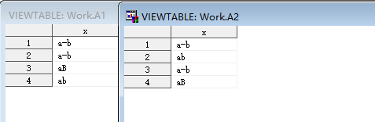

## 1 PROC SORT 基础语法

基础语法如下：  
```SAS
PROC SORT <collating-sequence-option> <other options>;
```

### 1.1 可选参数（Optional Arguments）

- DATA=*SAS-data-set*  
	- 指定输入数据集。  
- DATECOPY  
	- 对 SAS 数据集进行排序，而不更改数据集的创建日期和修改日期。  
- FORCE  
	- 强制冗余排序（forces redundant sorting）。  
- OVERWRITE
	- 在填充替换输出数据集之前删除输入数据集。  
- PRESORTED  
	- 指定数据集是否可能已经排序。  
- SORTSIZE=*memory-specification*  
	- 指定可用内存。  
- TAGSORT  
	- 减少临时磁盘使用。  

#### 1.1.1 创建输出数据集  

- DUPOUT=*SAS-data-set*  
	- 指定写入重复观测值的输出数据集。  
	- 需与 *NODUPKEY* 选项结合使用。
	- 示例程序：`proc sort data=test1 out=b nodupkey dupout=a;`    
- OUT=*SAS-data-set*  
	- 指定输出数据集。  
- UNIQUEOUT=*SAS-data-set*  
	- 指定写入消除唯一观测值的输出数据集。  
	- 需与 *NOUNIQUEKEY* 选项结合使用。
	- 示例程序：`proc sort data=test1 out=c nouniquekey uniqueout=d;`    

#### 1.1.2 消除重复观测（Eliminate duplicate observations）  

- NODUPKEY  
	- 删除具有（与第一个出现的值）重复的BY值的观测值。

#### 1.1.3 消除唯一观测（Eliminate unique observations）  

- NOUNIQUEKEY  
	- 从输出数据集中消除具有唯一排序KEY的观测值。

#### 1.1.4 Specify the collating sequence  

*collating-sequence* 的可选选项有：  

- ASCII  
- DANISH  
- EBCDIC  
- FINNISH  
- NATIONAL  
- NORWEGIAN  
- REVERSE
	- 反转字符变量的排序规则  
- SORTSEQ=*collating-sequence*  
- SWEDISH  

#### 1.1.5 指定输出顺序  

- EQUALS | NOEQUALS  
	- 指定 BY 组内的相对顺序。  
- NOEQUALS  
	- 不维持 BY 组内的相对顺序。  

🌟注意：只能在 PROC SORT 步骤中指定一个 *collating-sequence* 选项和多个其他选项， 两种类型的选项的顺序并不重要，并且在同一 PROC SORT 步骤中两种类型都不是必需的。  

## 2 SORTSEQ 选项  

基础语法：`SORTSEQ = collating-sequence`  

*collating-sequence* 可以是以下任一：  
- collating-sequence-option  
- translation_table  
- encoding-value  
- LINGUISTIC  

### 2.1 collating-sequence-option | translation_table  

指定 PROC SORT 语句整理序列选项之一（ASCII、DANISH、EBCDIC、FINNISH、NORWEGIAN、REVERSE、SWEDISH）或转换表，可以是 SAS 提供的转换表或任何用户定义的转换表。 SAS 提供的翻译表有：ASCII、DANISH、EBCDIC、FINNISH、ITALIAN、NORWEGIAN、POLISH、REVERSE、SPANISH 和 SWEDISH。  

程序示例：  
```SAS
proc sort data=mydata SORTSEQ=ASCII;
```

### 2.2 encoding-value  

指定编码值。结果与以指定编码表示的字符数据的二进制排序规则相同。  

### 2.3 LINGUISTIC<*(collating-options)*>  

指定 linguistic collation，根据与语言（language）和区域（locale）设置相关的规则，以文化敏感（culturally sensitive）的方式对字符进行排序。规则和默认排序顺序选项基于当前本地设置中指定的语言。该实现由 International Components for Unicode （ICU）库提供。它产生的结果在很大程度上与Unicode Collation Algorithms （UCA）兼容。  

#### 2.3.1 ALTERNATE_HANDLING=SHIFTED   

控制变量字符（如空格（spaces）、标点符号（punctuation）和符号（symbols））的处理。如果未指定此选项（使用默认值“Non-Ignorable”），则这些变量字符之间的差异与字母之间的差异同等重要。如果指定了ALTERNATE_HANDLING选项，则这些变量字符的重要性较小。  

程序示例：  
```SAS
data a;
   length x $ 10;
   x='a-b'; output;
   x='ab'; output;
   x='a-b'; output;
   x='aB'; output;
run;

proc sort data=a out=a1;
   by x;
run;   

proc sort data=a out=a2 sortseq=linguistic( ALTERNATE_HANDLING=SHIFTED );
   by x;
run;
```

结果如下图所示：  
  

如图所示：使用默认值 Non-Ignorable 时，排序方式为符号“-”、大写字母“B”、小写字母“b”；而使用 ALTERNATE_HANDLING 选项时，则仅关注“ab”文本，忽略符号、大小写带来的影响。  

#### 2.3.2 CASE_FIRST=  

指定大小写字母的顺序。此参数仅对 TERTIARY，QUATERNARY，或 IDENTICAL 有效。可选值为：  

- UPPER：将大写字母排在第一位，然后是小写字母。  
- LOWER：将小写字母排在第一位，然后是大写字母。  

#### 2.3.3 COLLATION=  

指定字符排序。可选值如下：  

- BIG5HAN：为拉丁文指定拼音顺序，并为中文、日文和韩文字符指定bug5字符集顺序。  
- DIRECT：指定印地语变体。  
- GB21312HAN：为拉丁文指定拼音顺序，并为中文、日文和韩文字符指定gb2312字符集顺序。  
- PHONEBOOK：指定用于字符排序的电话簿样式。仅使用德语选择PHONEBOOK。  
- PINYIN：指定基于逐字符音译为拼音的中文、日语和韩语字符的顺序。这种排序通常与简体中文一起使用。  
- POSIX：便携式操作系统接口（Portable Operating System Interface）。此选项指定字符的“C”区域设置顺序。  
- STROKE：指定字符的非字母书写样式排序。选择STROKE with Chinese、Japanese、Korean或Vietnamese languages。这种排序通常与繁体中文一起使用。  
- TRADITIONAL：指定字符排序的传统样式。例如，选择“TRADITIONAL with the Spanish Language”。  

#### 2.3.4 LOCALE=*locale_name*  

以POSIX名称（例如ja_JP）的形式指定localename。常用可选值如下：  

- zh_CN：Chinese_China  
- en_US：English_UnitedStates  
- en_GB：English_UnitedKingdom  

更多选项可参阅[Values for the LOCALE= System Option](https://support.sas.com/documentation/cdl/en/nlsref/61893/HTML/default/viewer.htm#a002613623.htm)。  

#### 2.3.5 NUMERIC_COLLATION=  

按数值而不是用于表示数字的字符对文本中的整数值进行排序。可选值如下：  

- ON：按数值排序。例如，“8 Main St.”将在“45 Main St.”之前。  
- OFF：按字符值排序。例如，“45 Main St.”将在“8 Main St.”之前。  

#### 2.3.6 STRENGTH=  

strength 的值与 collation level 有关。有五个 collation-level values。下表提供了有关五个级别的信息。strength 的默认值与 locale 有关。  

可选取值如下：  
- PRIMARY or 1  
	- PRIMARY指定基本字符之间的差异（例如："a" < "b"）。  
- SECONDARY or 2
	- 字符中的重音被视为次要差异（例如，“as”<“às”<“at”）。  
- TERTIARY or 3  
	- 字符的大小写差异在第三级进行区分（例如，“ao”<“ao”<“aå”）。  
- QUATERNARY or 4  
	- 当在1-3级忽略标点符号时，可以使用额外的级别来区分有标点符号和没有标点符号的单词（例如，“a-b”<“ab”<“ab”）。  
- IDENTICAL or 5  
	- 当所有其他级别都相等时，相同的级别被用作 tiebreaker （决胜负）。每个字符串的归一化形式D（NFD）形式的Unicodecode点值在该级别进行比较，以防在1-4级没有差异。  

