# 计数资料分析方法及SAS实现汇总  

## 1 描述性统计分析方法  

定性资料常用描述性统计分析为频数、频率，通常使用 **PROC FREQ** 过程→ *tables* 语句：  
```SAS
ods output OneWayFreqs=Test1;/*导出输出结果到test1数据集*/
proc freq data=sashelp.class;
    tables sex;/*sex为分类变量，取值为男/女*/
run;
ods output close;
```  

结果如下：  
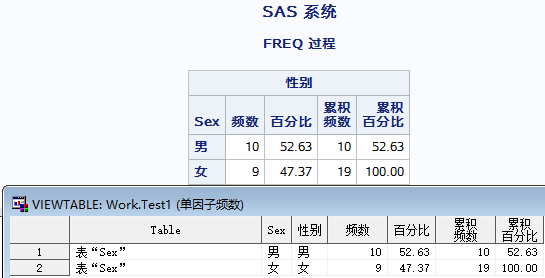  

## 2 单组样本  
### 2.1 二项分布  

二项分布（binomial distribution）是指在只会产生两种可能结果如“阳性”或“阴性”之一的 $n$ 次独立重复试验中，当每次试验的“阳性”概率 $\pi$ 保持不变时，出现“阳性”次数 $X\ =\ 0,1,2,...,n$ 的一种概率分布。其概率可由下面的公式求出：  
$$P(X)=\frac{n!}{X!(n-X)!}\pi^X(1-\pi)^{n-X}\ \ \ \ \ \ \ \ \ X=0,1,2,...,n \tag{1}$$    
>[!INFO]  二项分布的适用条件为：
>- 每次试验只会发生两种对立的可能结果之一，即分别发生两种结果的概率之和恒等于1。  
>- 每次试验产生某种结果（如“阳性”）的概率 $\pi$ 固定不变。  
>- 重复试验是相互独立的，即任何一次试验结果的出现不会影响其他试验结果出现的概率。

利用二项分布及其正态近似性，可进行总体率的区间估计和差异推断。当 $n$ 较大， $\pi$ 或 $(1-\pi)$ 不接近0，也不接近1时，二项分布 $B(n,\pi)$ 近似正态分布 $N(n\pi,n\pi(1-\pi))$ ，而对应的样本率 $p$ 也近似正态分布 $N(\pi,\sigma_p^2)$ 。  

##### 2.1.1 求总体率的置信区间

当 $n$ 较大， $p$ 和 $1-p$ 均不太小，如 $np$ 和 $n(1-p)$ 均大于5时，可利用样本率 $p$ 的分布近似正态分布来估计总体率的 $1-\alpha$ 可信区间。计算公式为：  
$$(p-u_{\alpha/2}S_p,p+u_{\alpha/2}S_p) \tag{2}$$   
>[!example] 示例
>例2-1 在观测一种药物对某种非传染性疾病的治疗效果时，用该药治疗了此种非传染性疾病患者100人，发现55人有效，试据此估计该药物治疗有效率的95%可信区间。

使用 **PROC FREQ** → *tables* 语句 → *binomial* 参数：  
```SAS
data tmp1;/*构建数据集*/
    aval = "无效"; count = 45; output;
    aval = "有效"; count = 55; output;
run;

proc freq data = tmp1;
    tables aval/ alpha=0.05 binomial (level="有效" cl=wald exact);
    /*alpa=0.05：指定生成95%置信区间（alpha默认值为0.05）；
      level="有效"：指定要计算置信区间的率的水平；
      cl=wald exact：指定置信区间的计算方法（cl取值有多种，具体可参见SAS帮助文档）*/
    weight count;
    output out=test2 binomial;/*导出binomial输出结果到test2数据集*/
run;
```  

结果如下：  
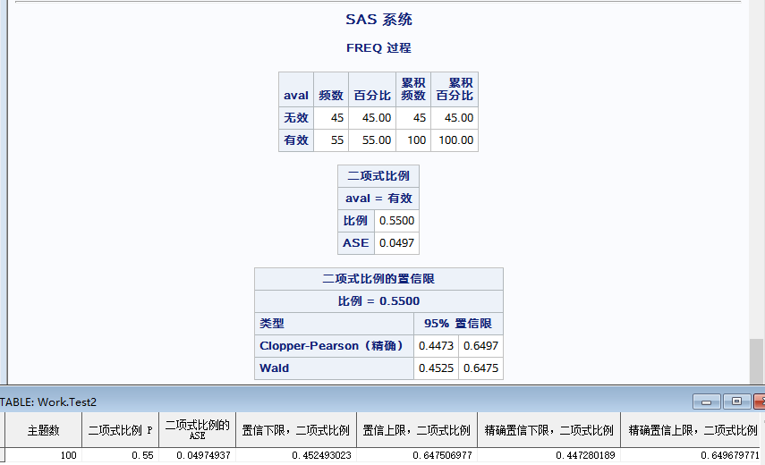  

##### 2.1.2 样本率与总体率的比较  

当 $n$ 较大， $p$ 和 $1-p$ 均不太小，如 $np$ 和 $n(1-p)$ 均大于5时，利用样本率的分布近似正态分布的原理，可作样本所在的总体率 $\pi$ 与已知总体率 $\pi_0$ 的比较。检验统计量 $u$ 值得计算公式为：  
$$u=\frac{p-\pi_0}{\sqrt{\pi_0(1-\pi_0)/n}} \tag{3}$$    
>[!example] 示例
>例2-2 已知某疾病采用常规治疗的治愈率为45%。现随机抽取180名该疾病患者改用新的治疗方法进行治疗，治愈117人。问新治疗方法是否比常规疗法的效果好？  

本例是单侧检验，记新治疗方法的治愈率为 $\pi$ ，而 $\pi_0=0.45$ 。其假设检验为：  
$$\begin{align}
&H_0:\ \pi=0.45 \\ 
&H_1:\ \pi>0.45
\end{align}$$  
  

使用 **PROC FREQ** → *tables* 语句 → *binomial* 参数：  
```SAS
data tmp1;/*构建数据集*/
    aval = "未治愈"; count = 63; output;
    aval = "治愈"; count = 117; output;
run;

proc freq data = tmp1;
    tables aval/ alpha=0.05 binomial (level="治愈" p=0.45 cl=wald exact);
    /*alpa=0.05：指定生成95%置信区间（alpha默认值为0.05）；
      level="治愈"：指定要计算置信区间的率的水平；
      p=0.45：指定要与之比较的总体率，取值可为0-1或0-100（百分比形式）；
      cl=wald exact：指定置信区间的计算方法（cl取值有多种，具体可参见SAS帮助文档）*/
    weight count;
    output out=test3 binomial;
run;
```  

结果如下：  
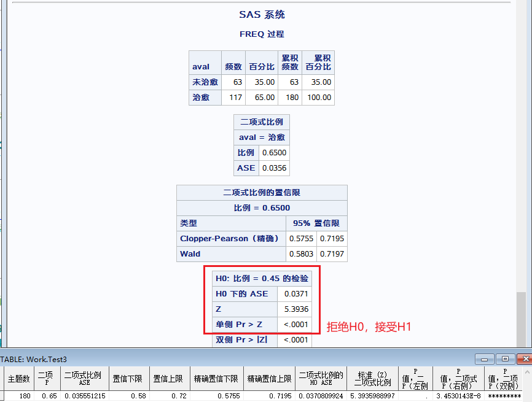  

### 2.2 Poisson分布  

Poisson 分布（Poisson distribution）作为二项分布的一种极限情况，已发展成为描述小概率事件发生规律的一种重要分布。它可用来分析医学上诸如人群中遗传缺陷、癌症等发病率很低的非传染性疾病的发病或患病人数的分布，也可用于研究单位时间内（或单位面积、容积、空间内）某罕见事件发生次数的分布，如分析在单位时间内放射性物质放射次数的分布，在单位面积或容积内细菌数的分布，在单位空间中某种昆虫或野生动物数的分布等。随机变量 $X$ 服从 Poisson 分布，是指在足够多的 $n$ 次独立试验中， $X$ 取值为 $0,1,2...,$ 的相应概率为：  
$$\begin{equation}
P(X)=\frac{e^{-\lambda}\lambda^X}{X!}\;X=0,1,2,... \tag{4}
\end{equation}
$$    
式中参数 $\lambda$ 即为总体均数， $e=2.71828$ 为一常数。且有 $\Sigma P(X)=1$ 。 $X$ 服从以 $\lambda$ 为参数的 Poisson 分布，记作 $X~P(\lambda)$ 。  

>[!INFO] Poisson分布的适用条件  
>假定在规定的观测单位内某事件（如“阳性”）平均发生次数为 $\lambda$ ，且该规定的观测单位可等分为充分多的 $n$ 份，其样本计数为 $X(X=0,1,2,...)$ 。则在满足下面三个条件时，有 $X~P(X)$ 。  
>- 普通性：在充分小的观测单位上 $X$ 的取值最多为1。  
>- 独立增量性：在某个观测单位上 $X$ 的取值与前面各观测单位上的 $X$ 的取值无关。  
 >- 平稳性： $X$ 的取值只与观测单位的大小有关，而与观测单位的位置无关。  

>[!INFO] Poisson分布的性质  
>- 总体均数 $\lambda$ 与总体方差 $\sigma^2$ 相等是 Poisson 分布的重要特征。  
>- 当 $n$ 很大，而 $\pi$ 很小，且 $n\pi=\lambda$ 为常数时，二项分布近似 Poisson 分布。  
>- 当 $\lambda$ 增大时，Poisson 分布渐进正态分布。<font color=blue>一般而言，$\lambda$ ≥20 时，Poisson 分布资料可作为正态分布处理</font>。  

##### 2.2.1 求总体率的置信区间  

对于获得的样本计数 $X$，当 $X$ ＞ 50 时，可采用正态近似法估计总体均数的 $1-\alpha$ 可信区间，计算公式为：  
$$\begin{align}
(X-u_{\alpha/2}\sqrt{X},X+u_{\alpha/2}\sqrt{X}) \tag{5}
\end{align}
$$  
其中 $u_{\alpha/2}$ 为标准正态分布分位数（SAS **PROBIT** 函数为左侧分位数）。SAS中分位数函数可参考[【新手必备】SAS常用函数整理 - 知乎 (zhihu.com)](https://zhuanlan.zhihu.com/p/26149913)。    

>[!example] 示例
例2-3 某研究者对某社区12000名居民进行了健康检查，发现其中有68名胃癌患者。估计该社区胃癌患病数的95%可信区间。  

可根据公式进行编程：  
```SAS
data a;
    X=68;/*X计数=68*/
    alpha=0.05;/*alpha取值为0.05*/
    LowerCL=X-probit(0.975)*sqrt(X);/*置信区间下限*/
    UpperCL=X+probit(0.975)*sqrt(X);/*置信区间上限*/
run;
```  

结果如下：  
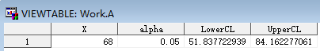  

##### 2.2.2 样本均数与总体均数的比较  

根据 Poisson 分布的性质，当 $\lambda$ ≥ 20 时，可用正态近似法来近似。样本计数 $X$ 与已知总体均数 $\lambda$ 的比较，检验统计量 $u$ 的计算公式为：  
$$\begin{equation}
u=\frac{X-\lambda}{\sqrt{\lambda}} \tag{6}
\end{equation}
$$  
>[!example] 示例
>例2-4 有研究表明，一般人群精神发育不全的发生率为3‰，今调查了有亲缘血统婚配关系的后代25000人，发现123人精神发育不全，问有亲缘血统婚配关系的后代其精神发育不全的发生率是否要高于一般人群？  
>
>可认为人群中精神发育不全的发生数服从 Poisson 分布。本例 $n$=25000，$X=123$，$\pi_0$=0.003，$\lambda=n\pi_0$=25000×0.003=75。假设检验为：  
>$$\begin{align}
>&H_0:\ \pi=0.003 \\
>&H_1:\ \pi>0.003
>\end{align}$$

可根据公式进行编程：  
```SAS
data b;
    n=25000;
    X=123;
    pi_0=0.003;
    lambda=n*pi_0;
    alpha=0.05;
    u=(X-lambda)/sqrt(lambda);/*求u值*/
    P=1-probnorm(u);/*且u对应的P值*/
run;
```  

结果如下：  
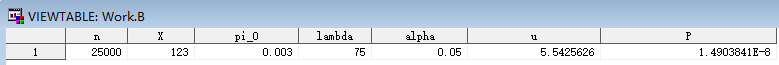  

## 3 配对四格表资料  

计数资料的配对设计常用于两种检验方法、培养方法、诊断方法的比较。其特点是对样本中各观察单位分别用两种方法处理，然后观察两种处理方法的某两分类变量的计数结果。观察结果有四种情况：

  

其中，$a$、$d$ 为两法观察结果一致的两种情况，$b$、$c$ 为两法观察结果不一致的两种情况。当两种处理方法无差别时，对总体有 $B=C$ ，即两总体率相等 $\pi_1=\pi_2$ 。

### 3.1 差异性检验  

由于在抽样研究中，样本中的 $b$ 和 $c$ 往往不等，为此，需要进行假设检验。对于配对四格表资料，假设检验方法为 McNeamr 检验，其检验统计量为：  
$$\begin{align}
\chi^2&=\frac{(b-c)^2}{b+c},\ v=1 \tag{7} \\
\chi_c^2&=\frac{(|b-c|-1)^2}{b+c},\ v=1 \tag{8}
\end{align}
$$  
公式 $(7)$ 用于 $(b+c)\ge40$ 时，公式 $(8)$ 用于 $(b+c)<40$ 时。<font color=red>值得注意的是，该法一般用于样本含量不太大的资料</font>。  

>[!example] 示例
>例3-1 某实验室分别用乳胶凝集法和免疫荧光法对58名可疑系统性红斑狼疮患者血清中抗核抗体进行测定，结果如下表，问两种方法的检测结果有无差别？  
>
>免疫荧光法（+） 乳胶凝集法（+）：11  
>免疫荧光法（+） 乳胶凝集法（-）：12  
>免疫荧光法（-） 乳胶凝集法（+）：2  
>免疫荧光法（-） 乳胶凝集法（-）：33  
>
>假设检验为：  
>$$\begin{align}
>&H_0:\ B=C，即两种方法的检测结果相同 \\
>&H_1:\ B\ne C，即两种方法的检测结果不相同  
>\end{align}$$ 

使用 **PROC FREQ** → *tables* 语句 → *agree* 参数：  
```SAS
data tmp2;
/*构建数据集：
	aval1=免疫荧光法；
	aval2=乳胶凝集法；
	aval1及aval2取值：1=+，2=-；*/
    aval1=1; aval2=1; count=11; output;
    aval1=1; aval2=2; count=12; output;
    aval1=2; aval2=1; count=2; output;
    aval1=2; aval2=2; count=33; output;
run;

proc freq data = tmp2;
    tables aval1 * aval2/ agree;
    weight count;
run;
```  

结果如下：  
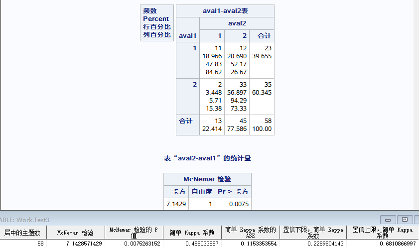  

### 3.2 等效性检验/非劣效性检验/优效性检验（置信区间法）  

参考文献[SAS® Macros CORR_P and TANGO: Interval Estimation for the Difference Between Correlated Proportions in Dependent Samples](https://analytics.ncsu.edu/sesug/2013/SD-03.pdf) 中介绍的 Tango's score confidence interval 来计算配对率差的置信区间。而后可通过率差的置信区间与预先设定的等效性/非劣效性/优效性界值来进行比较，以判定是否符合等效性/非劣效性/优效性假设。  

Tango 提出的两个相关的 proportions 的差值的置信区间是通过迭代求解以下两个方程来估计的，直到估计的变化值（change）在预先设定的 cutoff 值以下。  
$$\frac{b-c-n\lambda}{\sqrt{n(2\hat{\pi}_{21})+\lambda(1-\lambda)}}=\pm{Z_{\alpha/2}} \tag{9}$$  
$\hat{\pi}_{21}$ 的估计公式为：  
$$\hat{\pi}_{21}=\frac{\sqrt{(B^2-4AC)-B}}{2A} \tag{10}$$
  
其中， $A=2n$ ， $B=-b-c+(2n-b+c)\lambda$ ， $c=-c\lambda(1-\lambda)$ 。  

尽管 Tango CI 的计算过程比 Wald 和调整后的 Wald 区间更复杂，但上下限很容易通过割线法找到，具有经验上良好的覆盖概率[( Improved confidence intervals for the difference between binomial proportions based on paired data by Robert G. Newcombe, Statistics in Medicine, 17, 2635-2650 (1998))](https://pubmed.ncbi.nlm.nih.gov/10611622/)，并且可以应用于具有非对角线零单元的小样本。  

割线法原理可见百度：[割线法_百度百科 (baidu.com)](https://baike.baidu.com/item/%E5%89%B2%E7%BA%BF%E6%B3%95/5806354)  

根据公式 $(9)$ 可知，要求置信区间，需先得到 $\lambda$ 值，而 $\lambda$ 值则可通过割线法求解得到。具体的程序实现可参考文献：[SAS® Macros CORR_P and TANGO: Interval Estimation for the Difference Between Correlated Proportions in Dependent Samples](https://analytics.ncsu.edu/sesug/2013/SD-03.pdf) ，此处也附上我自己参考文献程序理解后写的宏程序：  
```SAS
/*---Tango---*/
/*割线法*/
%MACRO secant(x0,x1,Z,out);
/*--------------------------------
x0:初始值1
x1:初始值2
Z:百分位数
--------------------------------*/
data &out;
    /*迭代次数*/
    iteration=1;
    x0=&x0;
    x1=&x1;
    do until (abs(change)<0.000001);/*迭代停止条件*/
        /*位点1函数值*/
        lambda=x0;
        AA=2*&n;
        BB=-1*&b-&c+(2*&n-&b+&c)*lambda;
        CC=-1*&c*lambda*(1-lambda);
        q=(sqrt(BB**2-4*AA*CC)-BB)/(2*AA);
        /*fx0分情况考虑:分母为0与分母不为0*/
        if (&n*(2*q)+lambda*(1-lambda)>=0) then fx0=&b-&c-&n*lambda-&z*sqrt(&n*(2*q+lambda*(1-lambda)));
        if (&n*(2*q)+lambda*(1-lambda)<0) then fx0=&b-&c-&n*lambda;

  
        /*位点2函数值*/
        lambda=x1;
        AA=2*&n;
        BB=-1*&b-&c+(2*&n-&b+&c)*lambda;
        CC=-1*&c*lambda*(1-lambda);
        q=(sqrt(BB**2-4*AA*CC)-BB)/(2*AA);
        /*fx0分情况考虑:分母为0与分母不为0*/
        if (&n*(2*q)+lambda*(1-lambda)>=0) then fx1=&b-&c-&n*lambda-&z*sqrt(&n*(2*q+lambda*(1-lambda)));
        if (&n*(2*q)+lambda*(1-lambda)<0) then fx1=&b-&c-&n*lambda;
  
        /*位点1与位点2的割线值*/
        secant=(fx1-fx0)/(x1-x0);

        /*迭代位点*/
        x2=x1-(fx1/secant);

        /*位点差值*/
        change=x2-x1;

        /*继续迭代*/
        x0=x1;
        x1=x2;
        iteration=iteration+1;
    end;
    keep x1;
run;
%MEND secant;

  

/*TangoCI*/
%MACRO tangoci(indata,outdata,uid,row,col,level,alpha,format);

proc sql noprint;
    select count(&uid) into : n from &indata;
    select count(&uid) into : a from &indata where &row =  &level and &col =  &level;
    select count(&uid) into : b from &indata where &row =  &level and &col ne &level;
    select count(&uid) into : c from &indata where &row ne &level and &col =  &level;
    select count(&uid) into : d from &indata where &row ne &level and &col ne &level;

    select probit(1-&alpha/2) into : ZL from &indata;
    select probit(&alpha/2) into : ZU from &indata;
quit;

  
/*调用割线法宏求置信区间上下限*/
%secant(-0.9999,0.9999,&zl,cll);
%secant(-0.9999,0.9999,&zu,clu);


data &outdata;
length dif $40. cll 8. clu 8. cl $40.;
    merge cll(rename=(x1=cll)) clu(rename=(x1=clu));
    dif=put((&b-&c)/&n,&format);
    cl=cat("(",strip(put(cll,&format)),", ",strip(put(clu,&format)),")");
run;

  
/*清除过程所用数据集*/
proc datasets lib=work noprint;
    delete cll clu;
quit;

%MEND tangoci;
```

## 4 四格表资料  

### 4.1 差异性检验  
##### 4.1.1 $\chi^2$ 检验  

两样本率的比较可用 $u$ 检验，但实际工作中往往更多地应用 $\chi^2$ 检验。对于两样本率比较的资料，存在 $u^2=\chi^2$ 。  

$\chi^2$ 检验的检验统计量为 $\chi^2$，其基本公式为：  
$$\begin{align}
\chi^2&=\Sigma\frac{(A-T)^2}{T}=\frac{(ad-bc)^2n}{(a+b)(c+d)(a+c)(b+d)} \tag{9} \\
v&=(R-1)(C-1) \tag{10}
\end{align}$$    
公式 $(9)$ 亦称 $Pearson\chi^2$ 。式中 $A$ 为实际频数， $T$ 为理论频数， $R$ 为行数（2）， $C$ 为列数（2）。由公式 $(9)$ 可以看出， $\chi^2$ 值反映了实际频数与理论频数的吻合程度。若检验假设 $H_0$ 成立，实际频数与理论频数的差值会小，则 $\chi^2$ 也会小；反之，若检验假设 $H_0$ 不成立，实际频数与理论频数的差值会大，则 $\chi^2$ 值也会大。    

理论频数 $T$ 是根据检验假设 $H_0:\pi_1=\pi_2$ 确定的，其计算公式为：  
$$T_{RC}=\frac{n_R\times n_c}{n} \tag{11}$$  
式中 $T_{RC}$ 为第 $R$ 行第 $C$ 列的理论频数， $n_R$ 为相应行的合计， $n_C$ 为相应列的合计， $n$ 为总例数。  

##### 4.1.2 校正 $\chi^2$ 检验  

计数资料中的实际频数 $A$ 为分类资料，是不连续的，由公式 $(9)$ 计算的 $\chi^2$ 值是离散型分布。$\chi^2$ 界值表的依据是 $\chi^2$ 分布，而 $\chi^2$ 分布是连续型分布。因此，用公式 $(9)$ 计算的 $\chi^2$ 值查 $\chi^2$ 界值表所得的 $P$ 偏小，特别是当自由度 $v=1$ 时。为此，F. Yates 于1934 年提出了用 $|A-T|-0.5$ 计算 $\chi^2$ 的连续性校正公式：  
$$\chi^2_c=\Sigma\frac{(|A-T|-0.5)^2}{T}=\frac{(|ad-bc|-n/2)^2n}{(a+b)(c+d)(a+c)(b+d)} \tag{12}
$$
  
##### 4.1.3 Fisher确切概率检验  

当四格表资料中出现 $n<40$ 或 $T>1$ ，或用公式 $(9)$ 计算出 $\chi^2$ 值后所得的概率 $P\approx\alpha$ 时，需改用四格表资料的 Fisher 确切概率法。该法是由 R. A. Fisher 于1934 年提出的，其理论依据时超几何分布。  

具体原理及计算公式不在此处列出。  


>[!tip] 注意
>1. 当 $n\ge40$ 且所有的 $T>5$ 时：$\chi^2$ 检验；当 $P\approx\alpha$ 时，改用 Fisher 确切概率法。  
>2. 当 $n\ge40$ 但有 $1\le T<5$ 时：Yates校正公式，或 Fisher 确切概率法。  
>3. 当 $n<40$ 或 $T<1$ 时：Fisher 确切概率法。  

>[!example] 示例
>例4-1 某医院欲比较异梨醇口服液（试验组）和氢氯噻嗪+地塞米松（对照组）降低颅内压的疗效。将200例颅内压增高症患者随机分为两组，结果如下，问两组降低颅内压的总体有效率有无差别？  
>
>试验组：有效=99（90.48%），无效=5（13.52%）；
>对照组：有效=75（83.52%），无效=21（12.48%）。

使用 **PROC FREQ** → *tables* 语句 → *chisq* 参数 / *Fisher* 参数：  
```SAS
data tmp3;
/*构建数据集：
	group=组别，1=试验组，2=对照组；
	aval=疗效，1=有效，2=无效；*/
    group=1; aval=1; count=99; output;
    gtoup=1; aval=2; count=5; output;
    group=2; aval=1; count=75; output;
    group=2; aval=2; count=21; output;
run;

proc freq data = tmp3;
    tables group * aval/ chisq(warn=output) exact expected;
  /*chisq：进行卡方检验。
    warn=output：输出一个0/1变量到数据集，表示是否有超过20%的格子的理论频数小于5。
    根据变量值进行判断，选择卡方值(0)，还是选择确切概率法(1)。
    exact：进行fisher检验。*/
    weight count;
    output out=result1 chisq fisher phi pchi;
run;
```  

结果如下：  
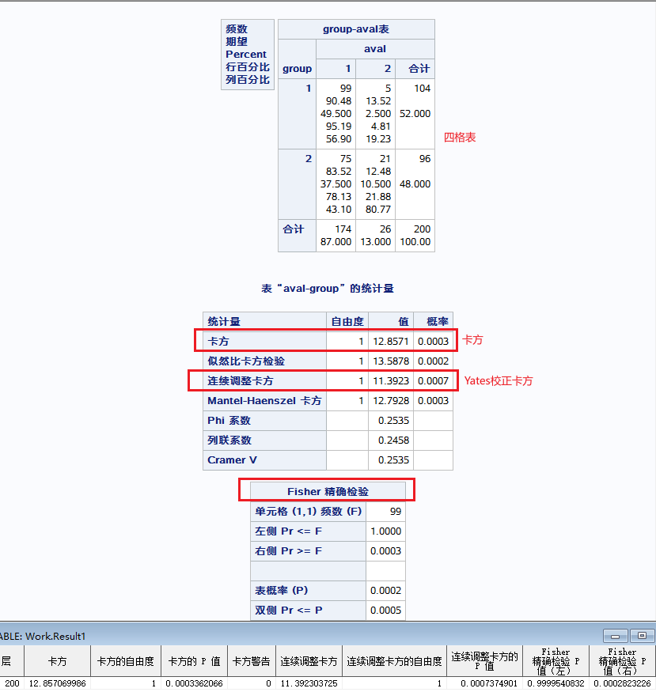  

### 4.2 非劣效性检验  

>[!example] 示例
>例4-2 一项验证新治疗方法A（试验组）非劣效于标准疗法B（对照组）的试验中，评价指标为有效率（高优指标），非劣界值 $\Delta=0.1$ ，检验水准 $\alpha=0.05$ （单侧）；试验结果如下：  
>试验组：有效=97，无效=15  
>对照组：有效=102，无效=10  
>
>假设检验为：  
>$$\begin{align}
>&H_0:\ P_T-P_C< -0.1 \\
>&H_1:\ P_T-P_C\ge -0.1
>\end{align}$$  
>
>问试验结果是否满足非劣效性假设？  

使用 **PROC FREQ** → *tables* 子句 → *riskdiff* 参数：  
```SAS
data tmp4;
/*构建数据集：
	group=组别，1=试验组，2=对照组；
	aval=疗效，1=有效，2=无效；*/
    group=1; aval=1; count=97; output;
    gtoup=1; aval=2; count=15; output;
    group=2; aval=1; count=102; output;
    group=2; aval=2; count=10; output;
run;

proc freq data=tmp4;
    tables group * aval /riskdiff (noninf MARGIN=0.10) alpha=0.05;
    /*riskdiff：计算率差；
      noninf：进行非劣效性检验
      margin：指定非劣效性界值*/
    weight count;
run;
```  

结果如下：  
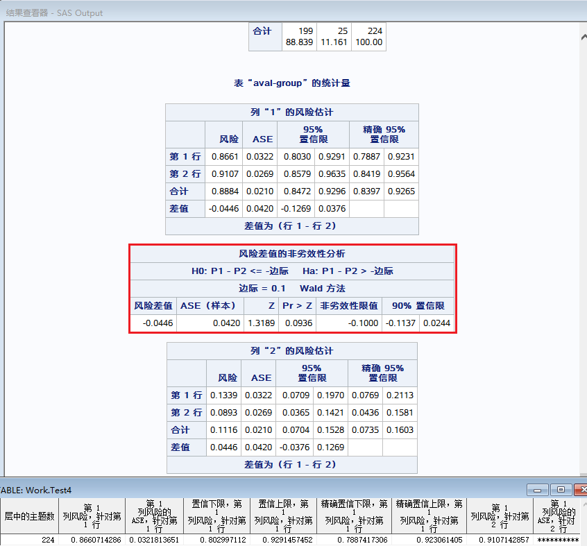  

### 4.3 等效性检验  

>[!example] 示例
>例4-3 一项验证新治疗方法A（试验组）等效于标准疗法B（对照组）的试验中，评价指标为有效率（高优指标），等效界值 $\Delta_1=0.05$ ，$\Delta_2=0.1$，检验水准 $\alpha=0.025$ （单侧）；试验结果如下：  
>试验组：有效=121，无效=14  
>对照组：有效=104，无效=10  
>
>假设检验为：  
>$$\begin{align}
>&H_0:\ P_T-P_C<-0.05\; OR\; P_T-P_C\ge0.1 \\
>&H_1:\ -0.05\le P_T-P_C\ge0.1
>\end{align}$$  
>
>问试验结果是否满足等效性假设？  

使用 **PROC FREQ** → *tables* 子句 → *riskdiff* 参数：  
```SAS
data tmp4;
/*构建数据集：
	group=组别，1=试验组，2=对照组；
	aval=疗效，1=有效，2=无效；*/
    group=1; aval=1; count=121; output;
    gtoup=1; aval=2; count=14; output;
    group=2; aval=1; count=104; output;
    group=2; aval=2; count=10; output;
run;

proc freq data=tmp4;
    tables group * aval/riskdiff (equiv MARGIN=(-0.05,0.1)) alpha=0.025;
    weight count;
    output out=result2 riskdiff;
    /*riskdiff：计算率差；
      equiv：进行等效性检验
      margin：指定等效性界值；若等效性界值上下限数值相等，如为-0.10，0.10，则MARGIN=0.10即可指定*/
run;
```  

结果如下：  
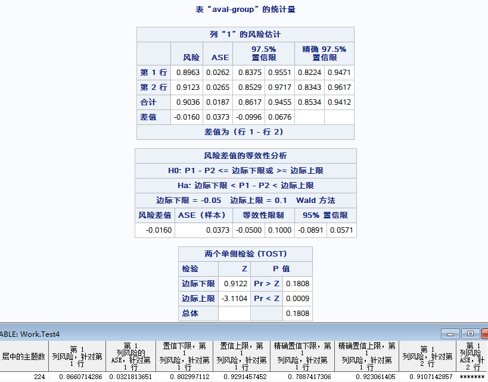  

### 4.4 优效性检验  

>[!example] 示例
>例4-4 一项验证新治疗方法A（试验组）优效于标准疗法B（对照组）的试验中，评价指标为有效率（高优指标），优效界值 $\Delta=0.05$ ，检验水准 $\alpha=0.025$ （单侧）；试验结果如下：  
>试验组：有效=134，无效=14  
>对照组：有效=104，无效=13  
>
>假设检验为：  
>$$\begin{align}
>&H_0:\ P_T-P_C<0.05 \\
>&H_1:\ P_T-P_C\ge0.05
>\end{align}$$  
>
>问试验结果是否满足优效性假设？  

使用 **PROC FREQ** → *tables* 子句 → *riskdiff* 参数：  
```SAS  
data tmp5;
/*构建数据集：
	group=组别，1=试验组，2=对照组；
	aval=疗效，1=有效，2=无效；*/
    group=1; aval=1; count=134; output;
    gtoup=1; aval=2; count=14; output;
    group=2; aval=1; count=104; output;
    group=2; aval=2; count=13; output;
run;

proc freq data=tmp5;
    tables group * aval/riskdiff (sup MARGIN=0.05) alpha=0.025;
    weight count;
    /*riskdiff：计算率差；
      sup：进行优效性检验
      margin：指定优效性界值*/
    output out=result3 riskdiff;
run;
```  

结果如下：  
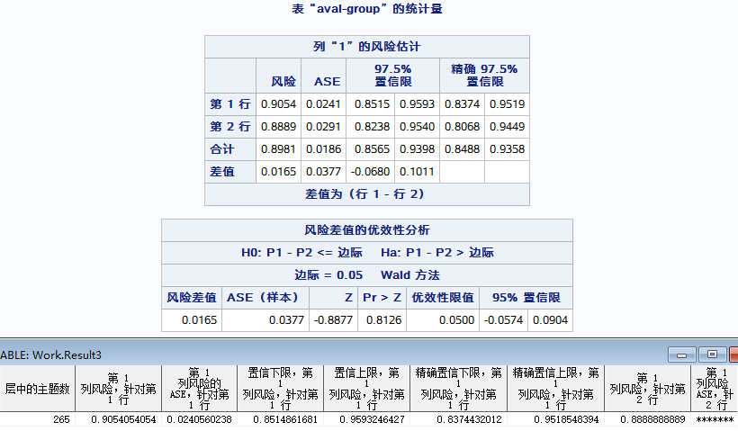  

## 5 R×C 表资料  

### 5.1 R×C表 资料总结  

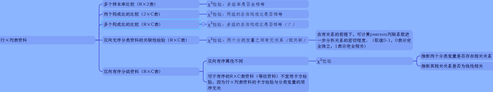  

### 5.2 多个样本率间的多重比较  

当多个样本率比较的 $R\times C$ 表资料 $\chi^2$ 检验，推断结论为拒绝 $H_0$，接受 $H_1$ 时，只能认为各总体率之间总的来说有差别，但不能说明任两个总体率之间有差别。要进一步推断哪两两总体率有差别，若直接用四格表资料的 $\chi^2$ 检验进行多重比较，将会加大犯 Ⅰ 类错误的概率。因此，样本率间的多重比较不能直接用四格表资料的 $\chi^2$ 检验。  

多个样本率间的多重比较的方法有 $\chi^2$ 分割法（partitions of $\chi^2$ method）、Scheffe' 可信区间法和 SNK 法。  

##### 5.2.1 $\chi^2$ 分割法  

多个样本率比较的资料可整理成 $2\times k$ 表资料，若不经任何处理，直接用分割法把 $2\times k$ 表 $\chi^2$ 分成多个独立的四格表 $\chi^2$ 进行两两比较，必须重新规定检验水准，其目的是为保证检验假设中Ⅰ型错误 $\alpha$ 的概率不变。  
###### 5.2.1.1 多个实验组间的两两比较  

分析目的为 $k$ 个实验组间，任两个率均进行比较时，须进行 $\begin{pmatrix}k \\2\end{pmatrix}$ 次独立的四格表 $\chi^2$ 检验，再加上总的行×列表资料的 $\chi^2$ 检验，共 $\begin{pmatrix}k\\2\end{pmatrix}+1$ 次检验假设。故检验水准 $\alpha'$ 用下式估计：  
$$\alpha'=\frac{\alpha}{\begin{pmatrix}k\\2\end{pmatrix}+1} \tag{13}$$  
式中，$\begin{pmatrix}k\\2\end{pmatrix}=\frac{k(k-1)}{2}$ ， $k$ 为样本率的个数。  

###### 5.2.1.2 实验组与同一个对照组的比较  

分析目的为各实验组与同一个对照组的比较，而各实验组间不须比较。其检验水准 $\alpha'$ 用下式估计  
$$\alpha'=\frac{\alpha}{2(k-1)} \tag{14}$$  
式中 $k$ 为样本率的个数。由该式估计的检验水准 $\alpha'$ 较保守。  