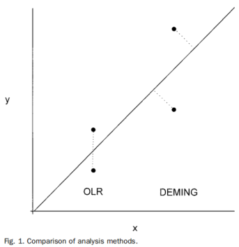

### 1 参考文献  
[1]王治国.临床检验方法比较研究中回归分析方法的介绍[J].陕西医学检验,1996,(02):18-20.  
[2]胡丽涛,王薇,王治国.回归和多元分析在参考物质互换性研究中的应用[J].中国卫生统计,2012,29(03):462-464.

### 2 方法简介  

在临床检验上通常需要检查两测定方法之间的系统差别。为了进行此项工作，由两方法检测同一组样本，在回归分析的基础上，评价系统差别。

最小二乘回归（OLR），假定 $Y$ 变量服从方差恒定的正态分布，自变量 $X$ 无误差。  

加权最小二乘回归，不要求考核方法的分析标准差在整个测定范围内固定。  

Deming回归，假设两个测量程序 $X$ 和 $Y$ 所得的结果都含有误差，其对回归模型斜率和截距的估计是根据观察点到回归线的垂直距离的平方和最小。  

加权Deming回归，考虑了两种方法非固定的分析标准差，例如，可假定两种方法受到比例测定误差（固定的变异系数）的影响。

OLR 和 Deming 回归的区别如图：  
  

