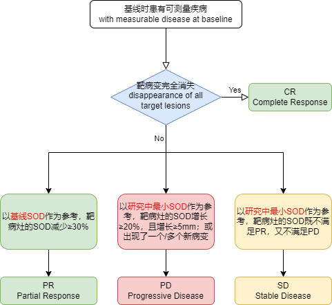

[TOC]

****

#RECIST guideline (Version 1.1)

全称：实体肿瘤疗效评价标准（response evaluation criteria in solid tumours）

指南：New response evaluation criteria in solid tumours: Revised RECIST guideline (version 1.1)

Eisenhauer E A, Therasse P, Bogaerts J, et al. New response evaluation criteria in solid tumours: revised RECIST guideline (version 1.1)[J]. European journal of cancer, 2009, 45(2): 228-247.

##1. 定义（definitions）

At baseline, tumour lesions / lymph nodes will be categorised measurable or non-measurable as follows:

在基线时，肿瘤病灶/淋巴结将被分类为可测量或不可测量，如下：

###1.1 可测量的（Measurable）

####1.1.1 肿瘤病灶（Tumour lesions）

必须能够在至少一个维度（at least one dimension）上被精确测量（记录测量平面中的最长直径logest diameter），**最小尺寸（minimum size）**要求为：

- 10 mm by CT scan

  CT扫描10mm（CT扫描切片厚度不大于5mm）。

- 10 mm caliper measurement by clinical exam

  临床检查10mm（卡尺测量）（卡尺不能准确测量的病灶应记录为不可测量）。

- 20 mm by chest X-ray

  胸部X线检查20mm

其他（待取证）：

CT检查：CT优先于MRI，CT扫描的有效性和重复性好；胸片和胸部CT测量病灶，优先选用CT扫描，特别以进展为治疗终点时（CT在发现新病灶等方面比较X片更敏感）

临床检查：表浅病灶建议使用彩色照片记录，附比例尺；当既可临床检查也可影像学检查时，应行影像学检查。

超声检查：不适用于评估病灶大小（超声检查重现性差，且结果依赖于检查者）；超声发现的新病灶，建议用CT或MRI验证。如果顾虑CT的射线照射，可用MRI代替。

####1.1.2 恶性淋巴结（Malignant lymph nodes）

要被认为是病理性增大且可测量，基线时，淋巴结应符合以下要求：

- a lymph node must be ≥ 15mm in short axis when assessed by CT scan

  通过CT扫描评估时，淋巴结**短轴**≥15mm

在基线和随访中，仅测量和跟踪短轴。

###1.2 不可测量的（Non-measurable）

所有其他病灶，包括小病灶（最长直径<10mm或短轴≥10至<15mm的病理淋巴结）以及真正不可测量的病灶。 真正不可测量的病变包括：软脑膜疾病、腹水、胸膜或心包积液、炎症性乳腺疾病、皮肤或肺部淋巴管受累、体检发现的腹部肿块/腹部器官肿大，但无法通过可重复的成像技术测量。

注意：Nodes that have a short axis <10mm are considered non-pathological and should not be recorded or followed.

短轴＜10mm的淋巴结被认为是非病理性的，不应被记录或跟踪。

###1.3 可测量病变的特殊考虑（Special considerations regarding lesion measurability）

####1.3.1 骨病变（Bone lesions）

- 骨扫描、PET 扫描或平片（plain films）不被认为是测量骨病变的足够成像技术。 然而，这些技术可用于确认骨病变的存在或消失。
- 具有可识别软组织成分的溶骨病变或混合溶骨性病变，如果软组织成分符合上述可测量性的定义，并且可以通过 CT 或 MRI 等横截面成像技术进行评估，则可以将其视为可测量病灶。
- 
  母细胞性骨损伤（blastic bone lesions）是不可测量的。

####1.3.2 囊性病变（Cystic lesions）

- 符合放射学（radiographically）定义的简单囊肿（simple cysts）标准的病变不应被视为恶性病变（不论可测量或不可测量），因为根据定义，它们就是简单囊肿。
- 被认为代表囊性转移的“囊性病变”如果符合上述可测量性的定义，则可以被视为可测量的病灶。 然而，如果同一患者中存在非囊性病变，则优选选择这些非囊性病变作为靶病灶（target lesions）。

####1.3.3 接受过局部治疗的病变（Lesions with prior local treatment）

位于先前照射区域或接受其他局部治疗区域的肿瘤病灶通常不被认为是可测量的，除非已证明病灶有进展。 研究方案应详细说明此类病变被认为可测量的条件。

##2. 肿瘤疗效评估（Tumour response evaluation）

###2.1 总体肿瘤负荷和可测量疾病的评估（Assessment of overall tumour burden and measurable disease）

为了评估客观反应或未来进展，有必要估计基线时的总体肿瘤负荷，并将其用作后续测量的比较器。 只有在基线时患有可测量疾病的患者才应纳入以客观肿瘤反应为主要终点的方案。 可测量疾病（measurable disease）的定义是存在至少一种可测量病变（measurable lesion）。 在主要终点是肿瘤进展（进展时间或固定日期进展比例）的研究中，方案必须明确是否仅限于患有可测量疾病的患者或仅患有不可测量疾病的患者也符合资格。

###2.2 目标和非目标病变的基线记录（Baseline documentation of 'target' and 'non-target' lesions）

- 当基线时存在超过一个可测量病灶时，代表所有相关器官的所有病变总计最多五个病变（每个器官最多两个病变）应被识别为靶病灶，并在基线时进行记录和测量。 这意味着，在患者仅涉及一个或两个器官部位的情况下，最多将分别记录两个和四个病灶）。 

- 将计算所有靶病灶的直径总和（*sum of the diameters, SOD*）（非淋巴结病灶的最长轴，淋巴结病灶的短轴）并报告为基线直径总和。 如果淋巴结要包含在总和中，则如上所述，仅将短轴添加到总和中。 基线总直径将用作参考，以进一步表征疾病可测量维度中的任何客观肿瘤消退。
- 所有其他病变（或疾病部位），包括病理淋巴结，应被识别为非靶病灶，也应在基线时记录。 不需要进行测量，这些病灶应按“存在”、“不存在”或在极少数情况下“明确进展”进行跟踪。 此外，可以将涉及同一器官的多个非目标病灶记录为病例记录表上的单个项目（例如“多个盆腔淋巴结肿大”或“多个肝转移瘤”）。

###2.3 缓解标准（response criteria）

####2.3.1 靶病灶的疗效评估（Evaluation of target lesions）

- ==完全缓解，Complete Response (CR)==

  所有靶病灶消失。 任何病理性淋巴结（无论是target还是non-target）的短轴必须减少至 <10 mm。

- ==部分缓解，Partial Response (PR)==

  以基线SOD为参考，靶病灶直径总和至少减少 30%。

- ==疾病进展，Progressive Disease (PD)==

  以研究中最小SOD作为参考（包括基线时直径总和），靶病灶直径总和至少增加 20%。 除了 20% 的相对增量外，总和还必须证明绝对增量至少为 5 毫米。 （注：出现一个或多个新病变也被视为进展）。

- ==疾病稳定，Stable Disease (SD)==

  以研究中最小SOD作为参考，既没有足够的shrinkage来满足 PR 的要求，也没有足够的increase来满足 PD 的要求。

#####2.3.1.1 靶病灶评估的特别注意事项（Special notes on the assessment of target lesions）

- ==淋巴结（lymph nodes）==

  对于被定义为靶病灶的淋巴结，它的实际短轴测量值应一直被记录，即使在试验中短轴降到了10mm以下。

  当淋巴结靶病灶满足CR的标准时，可能其短轴并不为0，因为短轴＜10mm的淋巴结被认为是正常的（normal）。

  对于CR，应保证每个淋巴结靶病灶（target nodal lesions）的短轴＜10mm。

  对于PR、SD和PD，实际的淋巴结短轴测量值应被包含在靶病灶的直径之和中。

- ==变得太小而无法测量的靶病灶（target lesions that become 'too small to measure'）==

  有时，基线时确定的靶病灶会在CT扫描中变得非常模糊（faint），以至于放射科医生（radiologist）不会去指定一个精确的测量值，而是将其记录为“too small to measure”。

  如果radiologist的意见（opinion）是病灶可能已经消失了（the lesion has likely disappeared），那么测量值应被记录为0mm。

  如果病灶确认存在但太小而无法测量，可记录为默认值5mm。（注意：此规则不太可能用于淋巴结，因为正常时它们通常具有可定义的大小，并且经常被脂肪包围； 然而，如果认为存在淋巴结并且隐约可见但太小而无法测量，则在这种情况下也应指定 5 毫米的默认值）

  注1：默认值5mm，来源于CT扫面的层厚5mm，但不应随CT切片的厚度而变化。

  注2：如果radiologist能够提供精确的测量值，即使这个值小于5mm，这个值也应该被记录。

- ==治疗中分裂或合并的病变（Lesions that split or coalesce on treatment）==

  当非结节病灶（non-nodal lesions）裂开后，应将碎片部分的最长径相加，计算靶病变直径总和。

  当病灶合并时，应维持每个病灶的平面，以助于计算每个病灶单独的最长径；如果病灶已经合并到不可分离的程度，则应该取“合并病灶（coalesced lesion）”的最长径（the longest diameter）。

####2.3.2 非靶病灶的疗效评估（Evaluation of non-target lesions）

即使一些非靶病灶是可测量的，但并不需要去测量它们，而是在方案中指定的时间点进行进行定性评估（be assessed only qualitatively）。

- ==完全缓解，Complete Response(CR)==

  所有非靶病灶消失，肿瘤标志物水平正常化（normalisation of tumour marker level）。 所有淋巴结的大小必须非病理性（短轴<10 mm）。

- ==Non-CR / Non-PD==

  一种或多种非靶病灶的持续存在和/或肿瘤标志物水平维持在正常限度以上。

- ==疾病进展，Progressive Disease(PD)==

  现有非靶病灶的明确进展（unequivocal progression）。出现一个或多个新病灶也被视为进展。

#####2.3.2.1 非靶病灶疗效评估的特别注意事项（Special notes on assessment of progression of non-target disease）

- ==有可测量病灶时（when the patient also has measurable disease）==

  要在非病灶上有明确进展，非靶病灶必须有总体水平的实质性恶化：即使靶病灶存在SD或PR，总体肿瘤负荷以达到足以终止治疗的程度。

  当靶病灶为PR/SD时，仅依据非靶病灶的变化就判定为“总体恶化”的情况是极其罕见的。

- ==无可测量病灶时（when the patient has only non-measurable disease）==

  在一些Ⅲ期试验中，当入选标准中没有规定必须存在可测量病灶时，就会出现这种情况。

  当非靶病灶改变导致整体疾病符合增加的程度相当于靶病灶出现疾病进展时，依据非靶病灶作出明确进展的定义，需要建立一种有效的检测方法来进行评估。如描述为肿瘤负荷增加，表示体积（volume）增加73%（相当于可测量病灶直径增加20%）。

  或如：腹膜渗出从“微量”到“大量”；淋巴管病变从“局部”到“广泛播散”；或在方案中描述为“足够改变治疗方法”。

#### 2.3.3 新病灶（New lesions)

- 新病灶的出现 = 疾病进展。
- 必须非常明确，确实时新病灶，而不能是由于扫描技术或/和非肿瘤引起（骨扫描中出现的“新”图像异常有可能是耀斑。）
- 基线时没有发现或扫描，之后发现的也作为新病灶（非可测量病灶太多，研究者未评估、记录的情况）。
- 如出现的新病灶很难鉴定（如太小），不能确认是否确实为新病灶时：
  1. 需要继续进行治疗
  2. 在之后的重复扫描判定后，若证实是一个明确的新病灶，那么PD日期为首次扫描日期。

- 新病灶的出现及消失都必须在每次肿瘤疗效评估时详细记录
- 可将FDG-PET（氟脱氧葡萄糖-正电子体层扫描成像）作为CT检查的补充。
  1. 基线时进行FDG-PET检查，结果为阴性，若之后检查中出现阳性，则为PD；
  2. 基线时未进行FDG-PET检查：结果以CT为准，日期以首次发现为准

###2.4 最佳总缓解（Best overall response）

| 首次总体疗效 | 下次总体疗效 | 最佳总体疗效BOR           |                      |
| ------------ | ------------ | ------------------------- | -------------------- |
| CR           | CR           | CR                        |                      |
| CR           | PR           | 确认首次实际为PR：BOR为PR |                      |
| CR           | PR           | 满足SD最小时限：SD        | 不满足SD最小时限：PD |
| CR           | SD           | 满足SD最小时限：SD        | 不满足SD最小时限：PD |
| CR           | PD           | 满足SD最小时限：SD        | 不满足SD最小时限：PD |
| CR           | NE           | 满足SD最小时限：SD        | 不满足SD最小时限：NE |
| PR           | CR           | PR                        |                      |
| PR           | PR           | PR                        |                      |
| PR           | SD           | SD                        |                      |
| PR           | PD           | 满足SD最小时限：SD        | 不满足SD最小时限：PD |
| PR           | NE           | 满足SD最小时限：SD        | 不满足SD最小时限：NE |
| NE           | NE           | NE                        |                      |
| SD           | CR           | SD                        |                      |
| SD           | PR           | SD                        |                      |
| SD           | SD           | SD                        |                      |
| SD           | NE           | 满足SD最小时限：SD        | 不满足SD最小时限：NE |
| NE           | CR           | SD                        |                      |
| NE           | PR           | SD                        |                      |
| NE           | SD           | SD                        |                      |
| NE           | NE           | NE                        |                      |

SD的最小时限：一般在方案中规定为6-8周。